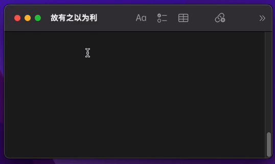

# Gerador de Adjetivos

Este projeto permite gerar adjetivos em português variando por gênero, a fim de tornar a comunicação mais doctíloqua, memoriosa e folgazona. Percebe?


## Funcionalidades

- Gera adjetivos na saída do terminal
- Copia esses adjetivos para a área de transferência
- Integrável com [espanso](https://espanso.org/)
- Multiplataforma
- Compatível com gênero neutro (em breve)


## Como utilizar

Utilize no terminal o comando `npx adjetivos [m/f] [n]` onde a primeira variável é qual o gênero dos adjetivos a serem gerados, e a segunda variável é o número de adjetivos desejados.

Além de mostrar no terminal os adjetivos gerados eles também serão copiados para a área de transferência, bastando colar onde deseja utilizar. É possível também integrar com o Espanso (detalhes abaixo) para mais prática utilização.

#### Exemplos e saídas:

`npx adjetivos m 3` //altiloquente, prolegômeno e cioso

`npx adjetivos f 4` //fortuita, adventícia, lhana e imperecível


## Como instalar

Para instalar é preciso ter um ambiente com node.js devidamente configurado. No [site oficial](https://nodejs.org/) do Node você pode encontrar como fazê-lo.

Utilize o comando abaixo para instalar globalmente o repositório:

```npm i -g adjetivos```


## Integração com Espanso (opcional)

O Espanso é um `expansor de texto` ou seja, ele monitora o que está sendo digitado em campos de texto a fim de substituir em tempo real a palavra-chave digitada por uma saída especial pré-determinada. Isso permite otimizar a digitação e também a saída de comandos do terminal; é aí que ele pode conversar com este gerador de adjetivos, dispensando a necessidade de se desvincular da janela atual e permitindo chamar o comando em qualquer janela.

<p align="center">
    
</p>

No site oficial dessa ferramenta [https://espanso.org/](https://espanso.org/) você poderá instalá-lo.

Na documentação do Espanso [neste link](https://espanso.org/docs/get-started/#configuration) você encontrará o diretório das configurações padrão do programa, que no momento da redação deste documento são:

```
Linux: $XDG_CONFIG_HOME/espanso (e.g. /home/user/.config/espanso)
macOS: $HOME/Library/Application Support/espanso (e.g. /Users/user/Library/Application Support/espanso)
Windows: {FOLDERID_RoamingAppData}\espanso (e.g. C:\Users\user\AppData\Roaming\espanso)
```

No diretório de configuração você encontrará o diretório `match` e **dentro dele** você deve criar um arquivo (por exemplo `adjetivos.yml`) com o conteúdo:

```
matches:
  
  - regex: ":adjetivos (?P<genero>[fm]) (?P<qtd>[0-9])"
    replace: "{{output}}"
    vars:
      - name: output
        type: shell
        params:
          cmd: "npx adjetivos {{genero}} {{qtd}}"
```

Ao salvar esse arquivo, automaticamente o espanso vai recarregar as configurações e estará funcionando a expansão do texto, por exemplo digitando `:adjetivos f 2` em qualquer lugar no sistema operacional, o programa automaticamente trocará por algo como `prolegômena e indulgente`.
## Referências

 - [Dicio](https://www.dicio.com.br/)
 - [Priberam](https://dicionario.priberam.org/)


## Autores

- [@lucaslealdev](https://www.github.com/lucaslealdev)


## Licença

[MIT](https://choosealicense.com/licenses/mit/)

